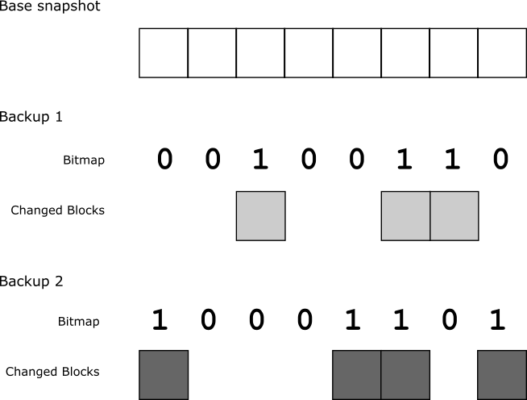

# Coalescing changed blocks onto a base VDI

When using backed up data to restore the state of a VDI, you must import a full VDI into XenServer.
You cannot import only the sets of changed blocks.
To import incremental backups created with changed block tracking data into XenServer, you must first use these incremental backups to create a full VDI.

A set of incremental backups created with changed block tracking can be used to create a full VDI whose data is identical to the source VDI at the time an incremental backup was taken.

For more information about incremental backup sets, see [Incremental backup sets](./using-with-vdi.md).

For example, you have a set of incremental backups that comprises:

-  A base snapshot that captures the data for the full VDI.

-  Backup 1: The first incremental backup, which consists of a bitmap list of blocks changed since the base snapshot and the data for only those changed blocks.

-  Backup 2: The second incremental backup, which consists of a bitmap  list of blocks changed since backup 1 and the data for only those changed blocks.



If you want to restore a VDI on XenServer to the state it was at when backup 2 was taken, you must create a VDI that takes blocks from the base snapshot, changed blocks from backup 1, and changed blocks from backup 2.
To do this, you can apply each set of changed blocks in sequence to the base snapshot of the VDI.

First build up a coalesced VDI by taking unchanged blocks from the base snapshot and changed blocks from those exported at backup 1.
The bitmap list of changed blocks that was used to create backup 1 defines which blocks are changed.

After coalescing the base snapshot with the changed blocks exported at backup 1, you have a full VDI whose data is identical to that of the source VDI at the time backup 1 was taken. Call this coalesced VDI "VDI 1".


Next, use this coalesced VDI, VDI 1, to create another coalesced VDI by taking unchanged blocks from VDI 1 and changed blocks from those exported at backup 2.
The bitmap list of changed blocks that was used to create backup 2 defines which blocks are changed.

After coalescing VDI 1 with the changed blocks exported at backup 2, you have a full VDI whose data is identical to that of the source VDI at the time backup 2 was taken.
Call this coalesced VDI "VDI 2".


This coalesced VDI, VDI 2, can be used to restore the state of the VDI on XenServer at the time that a snapshot was taken for backup 2.

When creating a coalesced VDI, ensure that you work with your VDIs and changed blocks as binary.

Ensure that you verify the integrity of the backed up and restored VDIs.
For example, you can do this by computing the checksums of the data.

## Examples

The following example shows how to create a coalesced VDI.
The example shows applying a single set of changed blocks to the base VDI snapshot.
To apply multiple sets of changed blocks, you must repeat this process for each set of changed blocks in order from oldest to most recent, using the output from the  previous iteration as the base VDI for the next iteration.

Python:

```python
def write_changed_blocks_to_base_VDI(vdi_path, changed_block_path, bitmap_path, output_path):
    bitmap = open(bitmap_path, 'r')
    vdi = open(vdi_path, 'r+b')
    blocks = open(changed_block_path, 'r+b')
    combined_vdi = open(output_path, 'wb')

    try:
        bitmap_r = bitmap.read()
        cb_offset = 0
        for x in range(0, len(bitmap_r)):
            offset = x * changed_block_size
            if bitmap_r[x] == "1":
                blocks.seek(cb_offset)
                blocks_r = blocks.read(changed_block_size)
                combined_vdi.write(blocks_r)
                cb_offset += changed_block_size
            else:
                vdi.seek(offset)
                vdi_r = vdi.read(changed_block_size)
                combined_vdi.write(vdi_r)
```